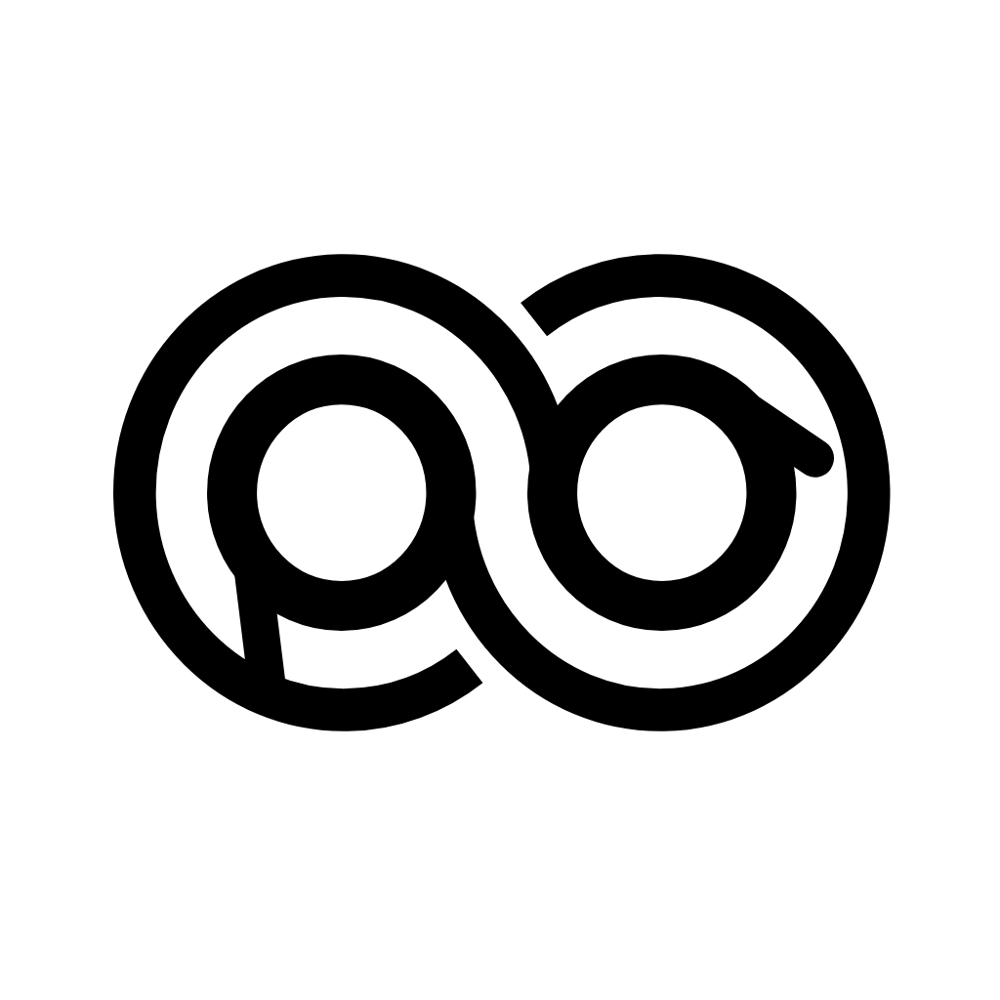
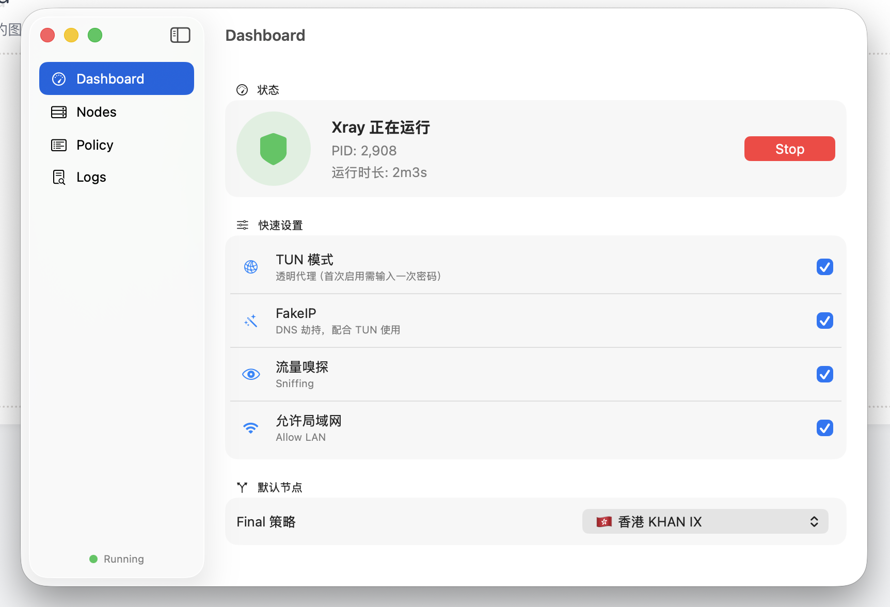
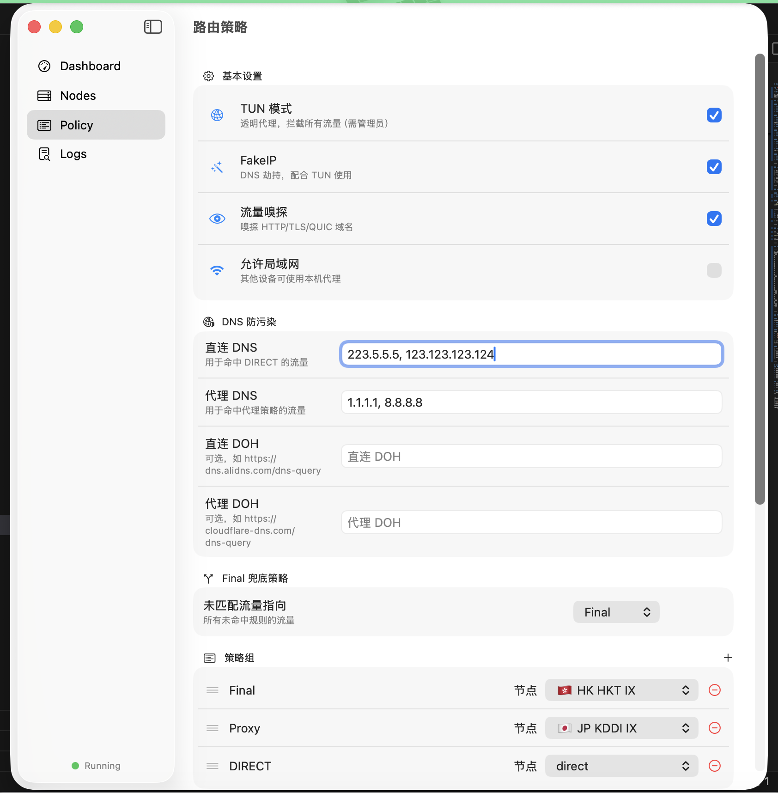
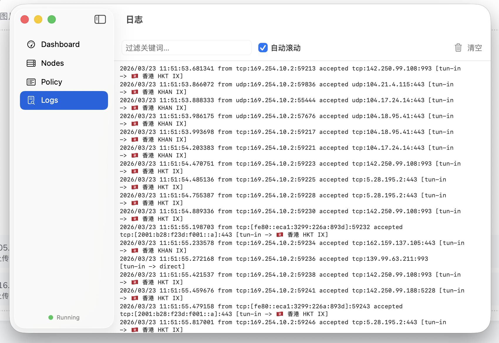

# LeoRay

<p align="center">
  
</p>

LeoRay 是一款专为 macOS 设计的现代化 Xray 代理客户端。原生 SwiftUI 界面 + Go 后端（xray_controller），轻量、便携、功能完整。

## ✨ 功能特性

### 🎛️ 代理核心
- **SOCKS5 / HTTP 代理**：双端口监听（1080 / 1081），开箱即用
- **TUN 全局代理**：基于 utun 设备的透明代理，接管系统全部流量
- **FakeIP + 流量嗅探**：TLS/HTTP/QUIC 域名嗅探，精准分流
- **手动控制**：Xray 内核手动启停，不自动运行

### 🌐 智能路由
- **策略组管理**：自定义策略组（如 Proxy / Streaming / Download），每组绑定不同出口节点
- **GEO 路由规则**：独立的 GEO 规则系统，基于 `geosite` / `geoip` 数据匹配流量并指向策略组
- **自定义规则**：支持 DOMAIN / DOMAIN-SUFFIX / DOMAIN-KEYWORD / IP-CIDR / GEOSITE / GEOIP 等类型
- **远程规则集**：兼容模式支持加载远程 `.list` 规则文件
- **路由诊断**：内置 Xray 实测探针 + Go 模拟引擎，快速定位流量分配结果

### 🛡️ DNS 防污染
- **分流 DNS**：直连流量使用国内 DNS（223.5.5.5），代理流量使用境外 DNS（1.1.1.1）
- **DOH 支持**：直连和代理 DNS 均可配置 DNS-over-HTTPS
- **TUN / 非 TUN 双模式生效**：即使不开启 TUN，SOCKS 代理模式也能享受 DNS 防污染

### 📡 节点与订阅
- **多订阅管理**：支持添加、刷新、删除多个订阅源，自动合并去重
- **节点测速**：
  - Xray 未运行：直接 TCP ping 到节点服务器（测通断）
  - Xray 运行中：通过代理发起 HTTPS 请求（测真实端到端延迟含 TLS 握手）
- **协议支持**：VLESS / VMess / Trojan / Shadowsocks，传输层支持 TCP / WS / gRPC / XHTTP / Reality

### 🖥️ 界面体验
- **原生 SwiftUI**：macOS 13+ 原生界面，系统状态栏菜单 + 完整仪表盘
- **一键授权**：首次 TUN 使用时通过 osascript 配置 sudoers，之后无弹窗
- **便携封装**：`build_app.sh` 一键打包为 `LeoRay.app`，所有资源内置

---

## 📸 截图

| Dashboard | 策略配置 |
|:---------:|:-------:|
|  |  |

| 日志 |
|:----:|
|  |

---

## 📦 编译构建

### 依赖环境
- **Go 1.21+**（编译后端 xray_controller）
- **Swift 5.9+ / Xcode CLT**（`swift build`，无需打开 Xcode）

### 一键打包
```bash
./build_app.sh
```

脚本自动完成：
1. `go build` 编译 Go 后端控制器
2. `swift build -c release` 编译 SwiftUI 前端
3. 拷贝 Xray 内核、GEO 数据、配置文件、图标等资源
4. 组装生成 `LeoRay.app`

> 💡 版本号在 `build_app.sh` 顶部的 `APP_VERSION` / `BUILD_VERSION` 变量中修改。

---

## 🚀 首次运行

由于非 Apple 签名，首次运行可能被 Gatekeeper 拦截。终端执行：
```bash
xattr -cr /路径/到/LeoRay.app
```
然后双击启动即可。

---

## 🧩 项目结构

```
LeoRay/
├── LeoRayUI/              # SwiftUI 前端
│   └── Sources/LeoRay/
│       ├── LeoRayApp.swift       # App 入口
│       ├── ContentView.swift     # 主视图框架
│       ├── DashboardView.swift   # 仪表盘（状态/启停/日志）
│       ├── PolicyView.swift      # 策略配置（策略组/GEO/DNS/规则）
│       ├── NodesView.swift       # 节点管理（订阅/测速）
│       ├── LogsView.swift        # 日志查看
│       ├── MenuBarView.swift     # 系统状态栏菜单
│       ├── Models.swift          # 数据模型
│       ├── APIClient.swift       # 后端 API 客户端
│       └── BackendManager.swift  # 后端进程管理
├── go/                    # Go 后端（API Server）
│   ├── main.go                   # HTTP 服务 + Xray 管理 + TUN 路由
│   ├── policy.go                 # 策略系统（组/GEO规则/DNS配置）
│   ├── node_manager.go           # 节点测速（TCP ping / HTTPS 延迟）
│   ├── subscription.go           # 多订阅管理
│   ├── parse_sub.go              # 订阅内容解析
│   ├── xray_outbound.go          # Xray 出站对象构建
│   └── clash_to_xray.go          # Clash 规则转换
├── core/                  # Xray 可执行内核
├── data/                  # 运行时数据
│   ├── geoip.dat                 # IP 地理数据库
│   ├── geosite.dat               # 域名地理数据库
│   └── custom_nodes.json         # 节点缓存
├── config/                # 配置文件
│   └── policy.json               # 策略配置（自动生成）
├── build_app.sh           # 一键打包脚本
└── README.md
```

---

## ⚙️ 策略配置说明

### 策略组
策略组是一个逻辑分组，绑定一个出口节点。默认 3 个：
- **Final**：兜底策略（所有未匹配的流量）
- **Proxy**：代理出口
- **DIRECT**：直连出口

### GEO 路由规则
GEO 规则将基于 `geosite`/`geoip` 的流量匹配绑定到策略组：
- `geosite:google` → Proxy
- `geosite:cn` → DIRECT
- `geoip:cn` → DIRECT

> 💡 更多可用的 geosite 规则请参考 [v2fly/domain-list-community](https://github.com/v2fly/domain-list-community/tree/master/data)

### DNS 防污染配置
| 配置项 | 默认值 | 说明 |
|--------|--------|------|
| 直连 DNS | `223.5.5.5`, `123.123.123.124` | 用于命中 DIRECT 的流量 |
| 代理 DNS | `1.1.1.1`, `8.8.8.8` | 用于命中代理策略的流量 |
| 直连 DOH | 空 | 可选，如 `https://dns.alidns.com/dns-query` |
| 代理 DOH | 空 | 可选，如 `https://cloudflare-dns.com/dns-query` |

---

# 上面是AI写的，下面我说一说
## 免责声明
- 此项目Code全是VibeCode，仅供学习交流，请勿用于非法用途，后果自负。
- 不保证任何功能可用，不保证任何功能可用，不保证任何功能可用。
- 如果动手能力强的，可以自己拉下来改改优化
- 仅测试了xhttp与Vless enc协议，其他自测
- 因为开启Tun模式，所以需要root权限，需要输入密码
- 内置的规则集随便写的，以及策略可能一团糟，可能需要自己修改策略

## 我知道的
- 项目是用Go写的，UI是SwiftUI，苹果原生平台
- 核心是xray，这个不必多说
- 好像我也不知道啥

# 鸣谢
感谢以下各位的全力支持！


|Google Antigravity|Gemini|Claude|
|---|---|---|
||||
